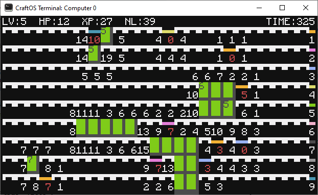

# Dungeon Sweeper

Welcome to Dungeon Sweeper, a game that runs similarly to MineSweeper.

## How to play

Enemies are levelled 1 through 9. You start at level 1.

Click a tile to uncover it. If there are no enemies underneath of it, the tile
will display the _total levels_ of the enemies around that tile. For example, if
you uncover a tile with the number 2 on it, there may either be 2 level 1
enemies around the tile, or one level 2 enemy somewhere around the tile.

If you click a tile and an enemy is there, a "battle" will be run. Enemies have
health equal to their level, and deal damage equal to their level. You always
attack first though.

The attack loop is as follows:

1. You attack.
2. If the enemy is still alive, they attack back.
3. Repeat until either you or the enemy dies.

This battle occurs instantly as you click the tile, and the screen will flash
red if you take damage as a result of attacking an enemy who is higher level
than you are.

The goal is to uncover every single tile.

## Game information

Along the top of your screen, your level, HP, XP, and "NL" (XP for next level)
are displayed.

Along the right side, the colors of the enemies and their levels are shown.

## Extra controls

`right-click`: Increment a "guess" value on the hovered tile. If you click on a
tile which has a guess on it, the game will first check if you are high enough
level to uncover it and will not uncover it if so. This helps to prevent
misclicks, and allows you to keep track of what is where.

`c`: Toggle the console. Not a whole lot of use here, I use it for a bunch of
debugging stuff.
